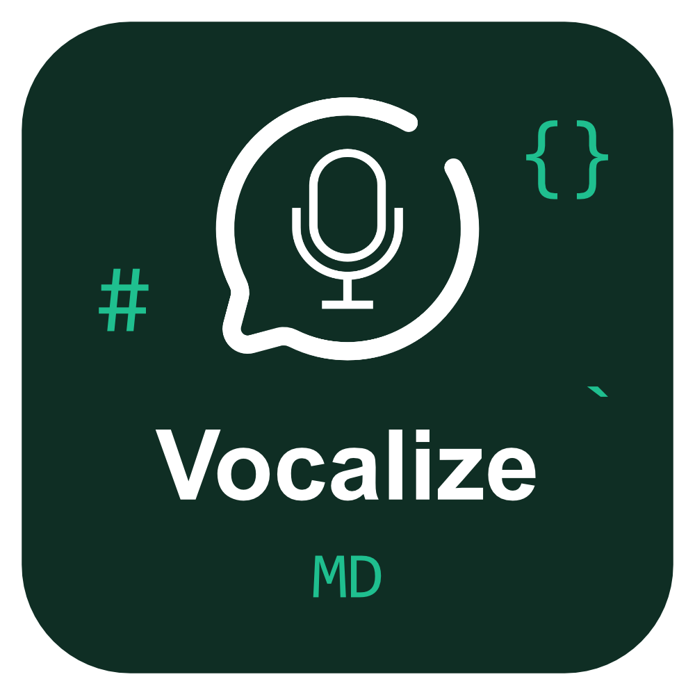

# Vocalize MD

A VS Code extension that converts Markdown files to natural-sounding speech using Deepgram's text-to-speech API and Gemini AI (via OpenRouter) for intelligent text processing.

## Description

Vocalize MD brings your Markdown documents to life with high-quality text-to-speech conversion. Whether you're proofreading your writing, making your content more accessible, or simply prefer listening to reading, Vocalize MD provides a seamless audio experience directly within VS Code.

The extension intelligently processes Markdown syntax using Gemini AI to create natural, readable text before converting it to speech with Deepgram's advanced TTS technology.

## Features

- 🎙️ **High-Quality Text-to-Speech**: Powered by Deepgram's neural TTS models
- 🤖 **Intelligent Markdown Processing**: Uses Gemini AI to convert Markdown to natural, readable text
- 🎨 **Multiple Voice Options**: Choose from 6 different voice models (male and female)
- ⚡ **One-Click Playback**: Simple toolbar button to read your Markdown files aloud
- 📝 **Word-Level Highlighting**: Visual feedback showing which word is currently being spoken
- 🔄 **Automatic Chunking**: Handles long documents by intelligently splitting text
- 🎯 **Markdown-Specific**: Automatically activates when working with Markdown files

## Installation

### From VS Code Marketplace (Recommended)

1. Open VS Code
2. Go to Extensions (Ctrl+Shift+X / Cmd+Shift+X)
3. Search for "Vocalize MD"
4. Click "Install"

### Manual Installation

1. Download the latest `.vsix` file from the [releases page](https://github.com/Geguchh024/VocalizeMD)
2. Open VS Code
3. Go to Extensions (Ctrl+Shift+X / Cmd+Shift+X)
4. Click the "..." menu at the top of the Extensions panel
5. Select "Install from VSIX..."
6. Choose the downloaded `.vsix` file

## API Setup

This extension requires API keys from two services: Deepgram (for text-to-speech) and OpenRouter (for Gemini AI text processing).

### Deepgram API Setup

Deepgram provides the text-to-speech conversion.

1. **Create a Deepgram Account**
   - Visit [https://console.deepgram.com/signup](https://console.deepgram.com/signup)
   - Sign up for a free account (includes $200 in free credits)

2. **Generate an API Key**
   - Log in to the [Deepgram Console](https://console.deepgram.com/)
   - Navigate to "API Keys" in the left sidebar
   - Click "Create a New API Key"
   - Give it a name (e.g., "Vocalize MD")
   - Copy the generated API key

3. **Add to VS Code Settings**
   - Open VS Code Settings (File > Preferences > Settings or Ctrl+,)
   - Search for "Vocalize MD"
   - Paste your API key into the "Deepgram API Key" field

**Official Documentation**: [Deepgram API Docs](https://developers.deepgram.com/docs)

### OpenRouter API Setup

OpenRouter provides access to Gemini AI for intelligent Markdown processing.

1. **Create an OpenRouter Account**
   - Visit [https://openrouter.ai/](https://openrouter.ai/)
   - Click "Sign In" and create an account

2. **Generate an API Key**
   - Go to [https://openrouter.ai/keys](https://openrouter.ai/keys)
   - Click "Create Key"
   - Give it a name (e.g., "Vocalize MD")
   - Copy the generated API key

3. **Add Credits (if needed)**
   - OpenRouter requires credits to use Gemini
   - Go to [https://openrouter.ai/credits](https://openrouter.ai/credits)
   - Add credits to your account (Gemini is very affordable)

4. **Add to VS Code Settings**
   - Open VS Code Settings (File > Preferences > Settings or Ctrl+,)
   - Search for "Vocalize MD"
   - Paste your API key into the "OpenRouter API Key" field

**Official Documentation**: [OpenRouter API Docs](https://openrouter.ai/docs)

## Usage

1. **Open a Markdown File**
   - Open any `.md` file in VS Code

2. **Click the Speaker Icon**
   - Look for the speaker/unmute icon in the editor toolbar (top-right)
   - Or use the Command Palette (Ctrl+Shift+P / Cmd+Shift+P) and search for "Vocalize MD: Read Aloud"

3. **Listen and Follow Along**
   - The extension will process your Markdown and begin reading it aloud
   - Words are highlighted as they're spoken for easy following
   - A webview panel opens showing the processed text and playback controls

4. **Control Playback**
   - Use the audio controls in the webview panel to pause, resume, or adjust volume
   - Close the panel to stop playback

_Note: Screenshots coming soon!_

## Configuration Options

| Setting | Description | Default | Options |
|---------|-------------|---------|---------|
| `vocalizeMd.deepgramApiKey` | Your Deepgram API key for text-to-speech | `""` | Any valid API key |
| `vocalizeMd.openrouterApiKey` | Your OpenRouter API key for Gemini text processing | `""` | Any valid API key |
| `vocalizeMd.voice` | Voice model to use for speech synthesis | `aura-asteria-en` | `aura-asteria-en` (female) `aura-luna-en` (female) `aura-stella-en` (female) `aura-orion-en` (male) `aura-arcas-en` (male) `aura-perseus-en` (male) |

To access these settings:
1. Open VS Code Settings (File > Preferences > Settings or Ctrl+,)
2. Search for "Vocalize MD"
3. Configure your preferences

## Troubleshooting

### "API key required" Error

**Problem**: You see an error message about missing API keys.

**Solution**: 
- Make sure you've configured both Deepgram and OpenRouter API keys in VS Code settings
- Follow the [API Setup](#api-setup) instructions above
- Restart VS Code after adding the keys

### No Audio Playback

**Problem**: The extension runs but you don't hear any audio.

**Solution**:
- Check your system volume and ensure it's not muted
- Verify your Deepgram API key is valid and has available credits
- Check the VS Code Developer Console (Help > Toggle Developer Tools) for error messages

### "Rate limit exceeded" Error

**Problem**: You see a 429 rate limit error.

**Solution**:
- Wait a few moments and try again
- Check your Deepgram account to ensure you have available credits
- The extension will automatically retry with exponential backoff

### Text Processing Fails

**Problem**: The Markdown processing step fails.

**Solution**:
- Verify your OpenRouter API key is valid
- Ensure you have credits in your OpenRouter account
- Check that your Markdown file isn't excessively large (try with a smaller file first)

### Extension Not Activating

**Problem**: The speaker icon doesn't appear in the toolbar.

**Solution**:
- Make sure you have a Markdown file open (`.md` extension)
- The extension only activates for Markdown files
- Try reloading VS Code (Developer: Reload Window)

## Contributing

We welcome contributions! Please see our [CONTRIBUTING.md](CONTRIBUTING.md) file for guidelines on:

- Setting up the development environment
- Code standards and conventions
- Submitting pull requests
- Reporting bugs and requesting features

## Security

⚠️ **Important Security Notice**

- **Never commit your API keys to version control**
- API keys are stored in VS Code settings (not in code)
- Keep your API keys private and secure
- If you accidentally expose an API key, revoke it immediately and generate a new one

## License

This project is licensed under the MIT License - see the [LICENSE](LICENSE) file for details.

---

Made with ❤️ for the VS Code community
